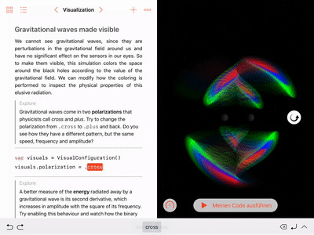
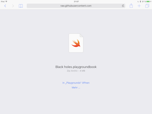
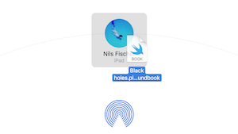
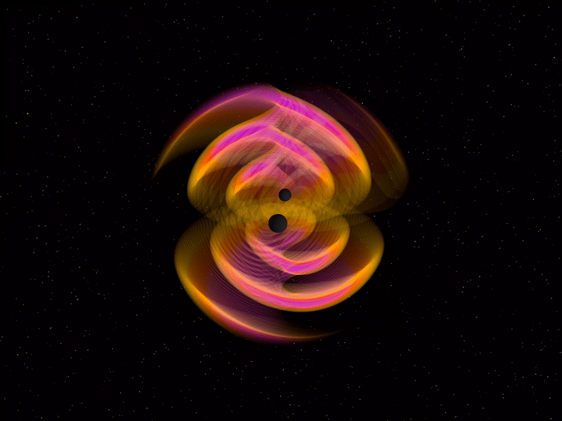

# Gravitational waves playground

In this [Swift playground book](http://www.apple.com/swift/playgrounds/) you can make [gravitational waves](https://en.wikipedia.org/wiki/Gravitational_wave) visible and control the visualization of this elusive radiation emitted by two inspiraling and merging black holes. It continues my series of interactive iPad simulations that started with my [playground book on black holes](https://nilsleiffischer.de/black-holes-playground/).

- Adjust the black hole masses:

  

- Control visualization parameters, such as wave polarization and colors:

  

- Explore the visualization in three dimensions:

  

## Installation

1. [Download the Swift Playgrounds App](https://itunes.apple.com/WebObjects/MZStore.woa/wa/viewSoftware?id=908519492&mt=8&ls=1) on your iPad.
2. [Add the _Play with Gravity_ feed to the Swift Playgrounds App](https://developer.apple.com/ul/sp0?url=https://nilsleiffischer.de/relativity-playgrounds-feed/feed.json) and load the _Gravitational waves_ playground.

**Alternatively**, this is the URL you can manually add to the Swift Playgrounds App to subscribe to the _Play with Gravity_ feed:

- _Play with Gravity_ feed URL: https://nilsleiffischer.de/relativity-playgrounds-feed/feed.json

You can also manually  [download the _Gravitational waves_ playground](https://github.com/nilsleiffischer/gravitational-waves-playground/raw/master/dist/Gravitational%20waves.playgroundbook.zip) on your iPad or Mac:

  - **On your iPad:** Select _Open with "Playgrounds"_.

    

  - Or **on your Mac:** [AirDrop](https://support.apple.com/en-us/HT203106) the file to your iPad and select _Open with "Playgrounds"_.

    

## Gallery

## Simulated physics

- The rendered field is the lowest-order metric perturbation in TT-gauge (or _gravitational wave strain_) $$h_+$$ or $$h_\times$$, with their $$\frac{1}{r}$$ distance scaling removed.
- Selecting the option `showFrequencyScaling` is equivalent to visualizing the real or imaginary part of the Weyl scalar $$\Psi_4$$, depending on the chosen polarization.
- The six colors are chosen from the normalized field values discretized into bins with edges $$\left\{\pm 1, \pm 0.7, \pm 0.5, \pm 0.3\right\}$$.
- The rotating spheres depict the relative Schwarzschild radius of the black holes, with an arbitary rescaling for visualization.
- Orbital separation, time and wave propagation speed are also arbitrarily rescaled. Relative quantities are correct, however.
- The ringdown is modeled as a simple quadrupolar oscillation with an exponential decay in amplitude for visualization purposes only.

## About this project

I created this Swift playground book as part of my application for the Apple WWDC 2018 scholarship. It allows the reader to discover physics that is invisible to our eyes by simulating it on screen and by controlling its visual representation. The volume rendering of the gravitational field is accomplished by a library of [Metal](https://developer.apple.com/metal/) shaders that apply to a [SceneKit](https://developer.apple.com/scenekit/) scene. The shaders perform ray-tracing through three-dimensional space and integrate the gravitational field along each ray. By translating the field values to colors and blending them together along the ray, I create a visual representation of the gravitational field in space.

- Author: [Nils Leif Fischer](https://nilsleiffischer.de)

Copyright (c) 2018 Nils Leif Fischer
